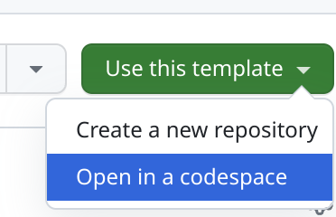
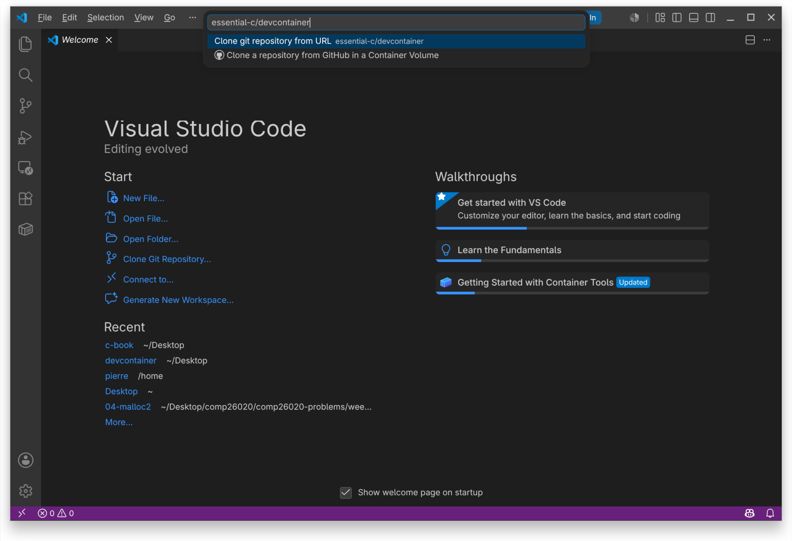
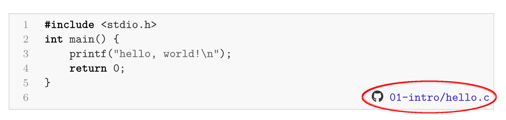

# C Programming Essential: Development Environment

This repository contains describes how to set up a development environment to complete the exercises and run the code samples presented in the book.

## Setting Up the Development Environment

There are 3 ways to bring up the environment:
- [Using GitHub Codespaces in your browser with any OS](#using-github-codespaces-in-your-browser) (recommended).
- [Using VSCode and Docker on Windows or Mac](#using-vscode-and-docker-on-windows-or-mac).
- [Using Linux natively or in a VM](#using-linux-natively-or-in-a-vm).

### Using GitHub Codespaces in your Browser

[GitHub Codespaces](https://github.com/features/codespaces) is a remote development environment that cna be accessed from a browser under any operating system.
Because of its seamless compatibility and deployment, it is the prefered method to obtain a proper development environment.
Codespaces is in absolute a paid feature but the free tier suffices to complete the book's exercises and run its code samples.
If somehow the free tier is not enough, see alternate solutions below.

To deploy a suitable Codespace instance, simply go to the [repository page on GitHub](https://github.com/essential-c/devcontainer), and click on `Use this template` then `Open in a codespace`:



Files created in the Codespace will persist until the Codespace is deleted (this can be done through the this interface: https://github.com/codespaces).

### Using VSCode and Docker on Windows or Mac

You can deploy locally the same environment used in the Codespace mentioned above, and connect a VSCode instance to it for a similar experience.
This require a few steps:

1. Install [VSCode](https://code.visualstudio.com/download) and get the [Dev Containers](https://marketplace.visualstudio.com/items?itemName=ms-vscode-remote.remote-containers) extension
2. Install [Docker](https://docs.docker.com/get-docker/)
3. Make sure Docker is running, Launch VSCode and bring up the command palette with the following command:
  - On Windows, <kbd>ctrl</kbd> + <kbd>shift</kbd> + <kbd>p</kbd>
  - On Mac, <kbd>shift</kbd> + <kbd>command</kbd> + <kbd>p</kbd>
4. Choose the command `Dev Containers: Clone Repository in Container Volume` and type the repo URL on GitHub: `olivierpierre/comp26020-devcontainer`



The container image will take a little amount of time to be fetched upon the first launch.
Subsequent executions will be much faster.

**The container is by default a volatile enviroment and all modifications to the filesystem will be lost when the container exits**.
To enable persistence see the relevant Docker [documentation](https://docs.docker.com/get-started/docker-concepts/running-containers/persisting-container-data/).

### Using Linux Natively or in a VM

The images used for the Codespace/container solutions are based on Ubuntu 26.04.
The following packages have been installed:

```
sudo apt-get update && sudo apt-get install -y build-essential valgrind \
    python3 vim bash-completion git gdb python3-pip
```

For the exercises, the book uses its own fork of the `check50` automated code checker, that can be downloaded and installed as follows:

```
git clone https://github.com/essential-c/check50.git
cd check50
pip install --break-system-packages .
```

## Running the Book's Code Samples

The vast majority of the code samples presented in the book have a GitHub logo on the bottom left, followed by the path to a file:



That path identifies the code samples' location within the repository, e.g., in the example below it is `00-logistics/sample-code.c`.
From there you can compile the source file and run the resulting program in a codespace or locally.

## Completing the Book's Programming Exercises

TODO.

